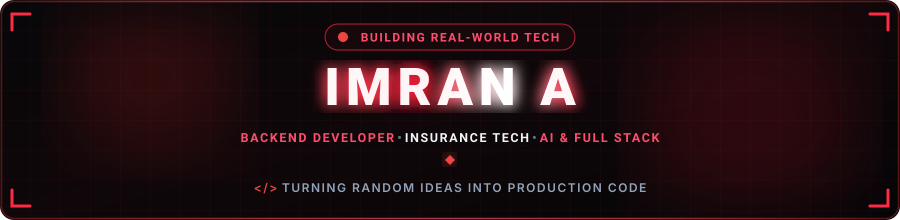
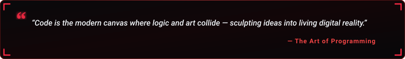

  

  

  
  &nbsp;
  
  &nbsp;
  
  &nbsp;
  

  

---

<h2 align="center">🔴 About Me</h2>

  

  

  Hey! I'm <b>Imran A</b>, a <b>B.Sc Computer Science</b> graduate and <b>AI Engineer</b> at <b>Owlsure</b>, based in Coimbatore, India. 
  I work on AI-driven software solutions, backend systems, APIs, and data-focused applications — turning ideas into practical and scalable solutions.

  
  &nbsp;
  
  &nbsp;
  
  &nbsp;
  

  💬 <b>Let's Discuss:</b> Python, .NET, PostgreSQL, AI, Data Science, System Design & Git Workflows. 
  ⚡ <b>Philosophy:</b> <i>"I turn random 2 AM ideas into production-ready code!"</i>

<table width="100%" border="0" align="center">
<tr>
<td width="50%" align="center" style="padding: 14px;">
  <h4>🤖 Current Role</h4>
  

    <b>AI Engineer @ Owlsure</b> 
    AI-driven Software & Data Solutions
  

</td>

<td width="50%" align="center" style="padding: 14px;">
  <h4>🌱 Active Deep Dives</h4>
  

    <b>AI & Data Science</b> 
    Software Engineering & Data Technologies
  

</td>
</tr>

<tr>
<td width="50%" align="center" style="padding: 14px;">
  <h4>📱 Portfolio</h4>
  

    <a href="https://imranabdul-cmd.github.io/portfolio" target="_blank">
      <b>View Portfolio</b>
    </a> 
    Projects & Case Studies
  

</td>

<td width="50%" align="center" style="padding: 14px;">
  <h4>🧠 Interests</h4>
  

    <b>Artificial Intelligence & Data</b> 
    Building practical software solutions
  

</td>
</tr>
</table>

---

<h2 align="center">🛠️ Tech Stack & Skills</h2>

<b>Core Programming Languages</b>

  

<b>Backend, Web & Databases</b>

  

<b>AI, Data Science & Tools</b>

  

  
  &nbsp;
  
  &nbsp;
  
  &nbsp;
  
  &nbsp;
  

---

<h2 align="center">📊 GitHub Analytics & Activity</h2>

  
  &nbsp;&nbsp;
  

  

  

---

<h2 align="center">⚡ Contribution Journey</h2>

  

---

<h2 align="center">📬 Let's Connect</h2>

  <i>Whether you want to discuss AI, software engineering, data, or just say hello — my inbox is always open!</i>

<table border="0" align="center">
<tr>

<td align="center" width="220" style="padding: 16px;">
  <a href="https://www.linkedin.com/in/imran-a-508637361" target="_blank">
    
      
    
  </a>
   
  <b>Professional Network</b>
</td>

<td align="center" width="220" style="padding: 16px;">
  <a href="https://imranabdul-cmd.github.io/portfolio" target="_blank">
    
      
    
  </a>
   
  <b>Projects & Case Studies</b>
</td>

<td align="center" width="220" style="padding: 16px;">
  <a href="mailto:imran.abdul.official@gmail.com">
    
      
    
  </a>
   
  <b>Direct Collaboration</b>
</td>

</tr>
</table>

  

