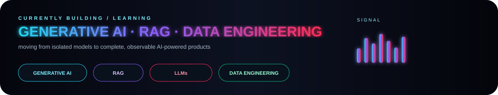
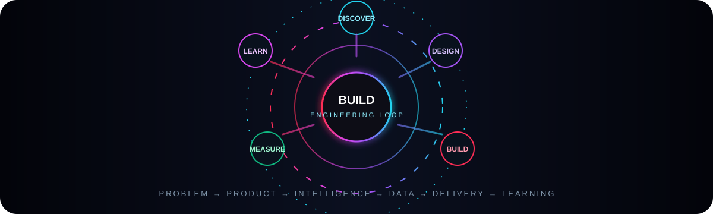
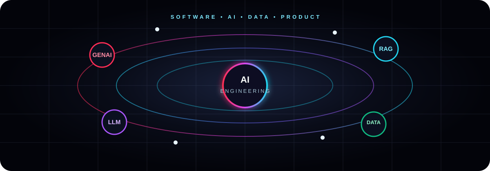
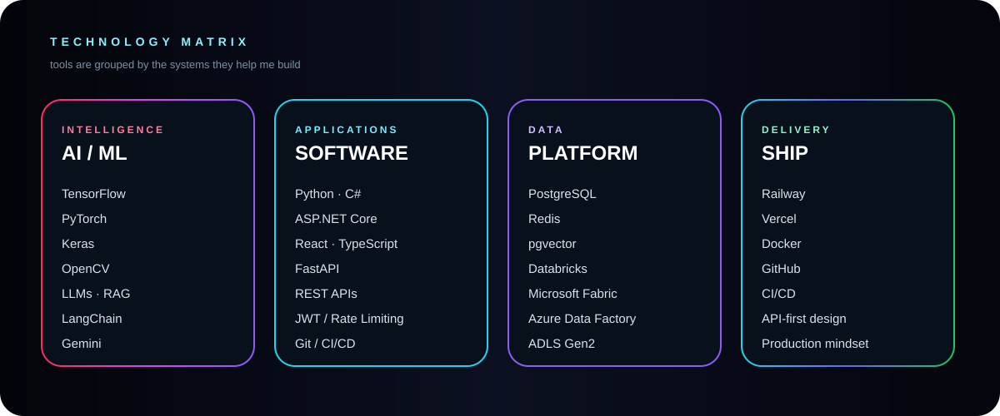
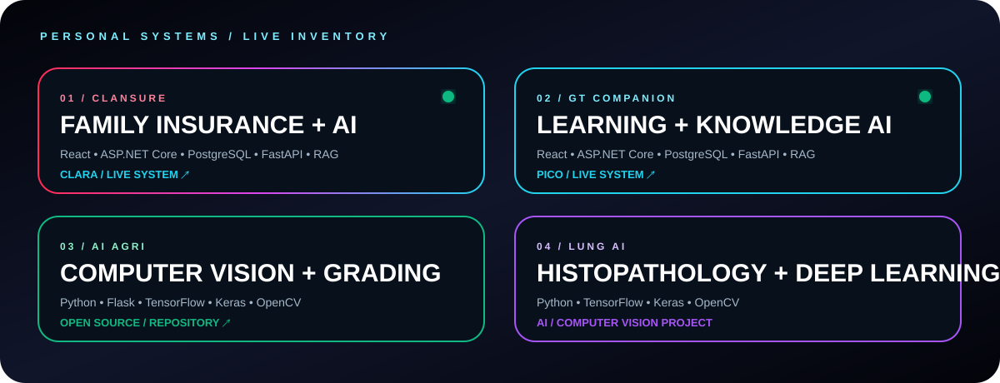
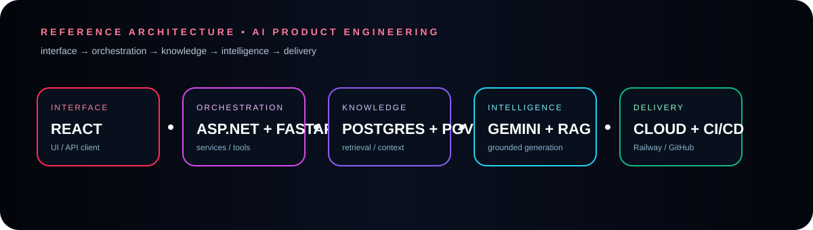

 

 

---

## ABOUT

<table>
<tr>
<td width="58%" valign="top">

<h3>Imran A</h3>

<b>Software Engineer · AI Engineer</b> 
OwlSure — a business unit of ValueMomentum 
Chennai, Tamil Nadu, India

  

I build at the intersection of **software engineering, artificial intelligence, generative AI and product development**.

My journey started with computer science, deep learning and computer vision, then moved toward complete product systems: APIs, data models, RAG pipelines, user experiences, deployment and production-minded engineering.

<b>Identity snapshot</b>

<pre>
role        : Software Engineer | AI Engineer
organization: OwlSure / ValueMomentum
location    : Chennai, Tamil Nadu, India

current:
  • Generative AI
  • RAG / LLM applications
  • AI product engineering
  • Data engineering
  • Modern full-stack systems
</pre>

</td>
<td width="42%" align="center" valign="top">

  

  

</td>
</tr>
</table>

---

## CURRENT SIGNAL

 

---

## THE TECH UNIVERSE

<b>Technology map</b>

**Languages**  
Python · C# · JavaScript · TypeScript

**AI / ML**  
TensorFlow · Keras · PyTorch · OpenCV · Machine Learning · Deep Learning · Computer Vision

**Generative AI**  
LLMs · RAG · LangChain · Gemini API · Vector Embeddings · pgvector

**Application Engineering**  
ASP.NET Core · REST APIs · FastAPI · Flask · React · Vite · Tailwind CSS

**Data / Platform**  
PostgreSQL · Redis · Databricks · Microsoft Fabric · Azure Data Factory · ADLS Gen2

**Delivery**  
Git · GitHub · CI/CD · Docker · Railway · Vercel

---

## SYSTEMS I HAVE BUILT

 

<table>
<tr>
<td width="50%" valign="top">

### ClanSure

**Family Insurance Management Platform**

A centralized family insurance platform for policies, documents, claims, renewals, family relationships, marketplace flows and protection insights.

**AI layer:** Clara · Gemini · RAG · pgvector

<a href="https://family-portal.up.railway.app/">LAUNCH LIVE SYSTEM ↗</a>

<b>Technical stack</b>

React · TypeScript · Vite · Tailwind CSS · Shadcn/UI · ASP.NET Core · C# · Entity Framework Core · JWT · PostgreSQL · Redis · FastAPI · LangChain · Gemini API · pgvector · Railway

</td>
<td width="50%" valign="top">

### GT Companion

**Training & Knowledge Platform**

A structured training system that brings roadmaps, presentations, learning resources, videos, quizzes and mentor content into one learning flow.

**AI layer:** Pico · Gemini · RAG

<a href="https://gt-companion.up.railway.app/#landing">LAUNCH LIVE SYSTEM ↗</a>

<b>Technical stack</b>

React · TypeScript · Vite · Tailwind CSS · ASP.NET Core · C# · PostgreSQL · FastAPI · LangChain · Gemini API · Redis · Railway

</td>
</tr>

<tr>
<td width="50%" valign="top">

### AI Agri Quality Inspection

Computer-vision system for fruit quality inspection, defect detection, grading and profit estimation.

<a href="https://github.com/imranabdul-cmd/AGRI-GRADE-AUTOMATED-QUALITY-GRADING-AND-PROFIT-ESTIMATION-SYSTEM-">OPEN REPOSITORY ↗</a>

<b>Stack</b>

Python · Flask · TensorFlow · Keras · OpenCV · HTML · CSS · JavaScript · SQLite

</td>
<td width="50%" valign="top">

### Lung Cancer Detection

Histopathology image classification project using deep learning and image preprocessing.

<b>Stack & classes</b>

Python · TensorFlow · Keras · OpenCV

Classes:
- Benign Tissue
- Adenocarcinoma
- Squamous Cell Carcinoma

</td>
</tr>
</table>

---

## HOW THE AI PRODUCTS FIT TOGETHER

 

<b>ClanSure RAG path</b>

USER → REACT → ASP.NET CORE → POSTGRESQL → FASTAPI → LANGCHAIN → GEMINI → RAG / PGVECTOR → CLARA

<b>GT Companion RAG path</b>

LEARNER → WEB APP → TRAINING CONTENT → RETRIEVAL → LLM → PICO

---

## MISSION POSSIBLE — 1ST PRIZE

  

<strong>Two systems. One practical challenge.</strong>

 

ClanSure + GT Companion

---

## EDUCATION

<table>
<tr>
<td width="50%" valign="top">

### MCA — Generative AI
**SRM University, Chennai**  
Currently pursuing

</td>
<td width="50%" valign="top">

### B.Sc Computer Science
**PSG College of Arts & Science**  
**74.77%**

</td>
</tr>
</table>

---

## GITHUB TELEMETRY

  

  

---

## ENGINEERING PRINCIPLES

<table>
<tr>
<td align="center">01 <b>Problem first</b> Start with the real user need.</td>
<td align="center">02 <b>Ground AI</b> Retrieval before confident answers.</td>
<td align="center">03 <b>Design systems</b> Model, API, data and UI belong together.</td>
<td align="center">04 <b>Ship</b> Small useful releases beat perfect plans.</td>
</tr>
</table>

---

## CONNECT

  

 

<b>Profile roadmap</b>

Next visual layers can live here without making the main page noisy:

- interactive Three.js visual lab
- deeper architecture explorations
- certification vault
- project case studies
- engineering notes

IMRAN A · SOFTWARE ENGINEER · AI ENGINEER · BUILDING INTELLIGENT SYSTEMS

