

  

  <a href="https://github.com/imranabdul-cmd">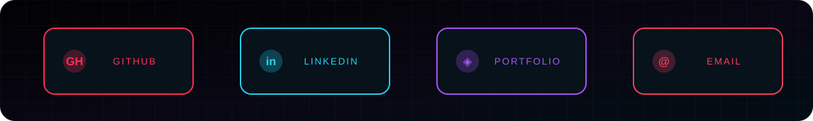</a>

## IDENTITY

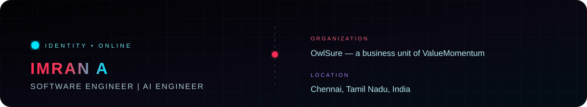

## JOURNEY

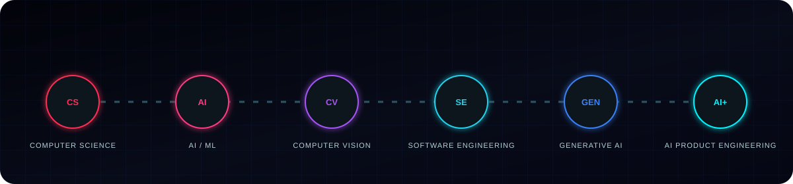

## EXPERIENCE

<a href="https://www.owlsure.com/home-global/?geo=global&amp;geosub=in">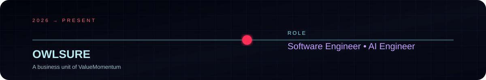</a>

## TECH DNA

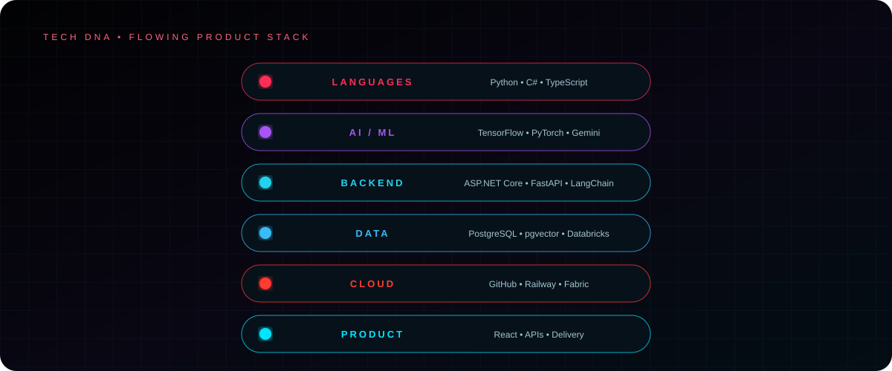

  LANGUAGES: Python · C# · TypeScript &nbsp;•&nbsp; AI / ML: TensorFlow · PyTorch · Gemini · LangChain &nbsp;•&nbsp; BACKEND: ASP.NET Core · FastAPI &nbsp;•&nbsp; FRONTEND: React &nbsp;•&nbsp; DATA: PostgreSQL · pgvector · Databricks · Microsoft Fabric &nbsp;•&nbsp; CLOUD / DEVOPS: GitHub · Railway

## FEATURED SYSTEMS

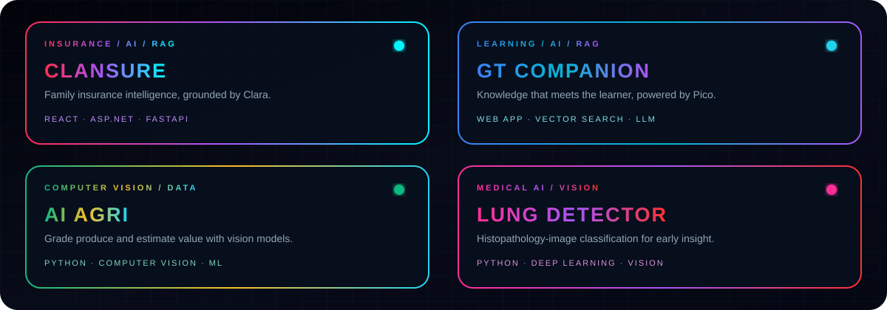

  <a href="https://family-portal.up.railway.app/">OPEN CLANSURE ↗</a>&nbsp;&nbsp;•&nbsp;&nbsp;
  <a href="https://gt-companion.up.railway.app/#landing">OPEN GT COMPANION ↗</a>&nbsp;&nbsp;•&nbsp;&nbsp;
  <a href="https://github.com/imranabdul-cmd/AGRI-GRADE-AUTOMATED-QUALITY-GRADING-AND-PROFIT-ESTIMATION-SYSTEM-">AI AGRI REPOSITORY ↗</a>

## AI ARCHITECTURE

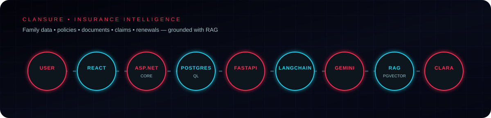

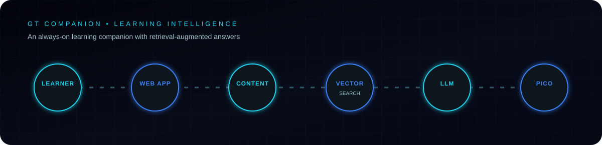

## CURRENT FOCUS

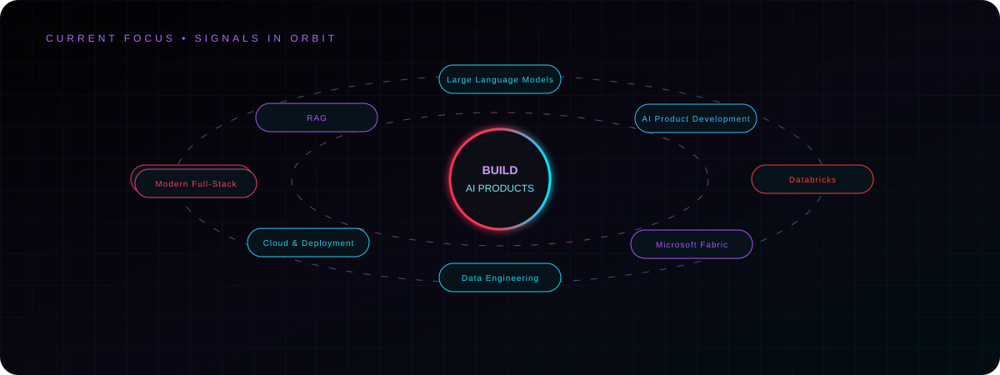

## EDUCATION

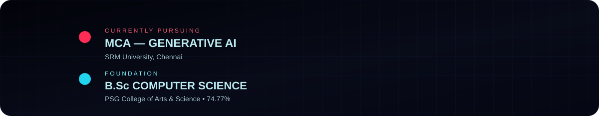

## ACHIEVEMENTS

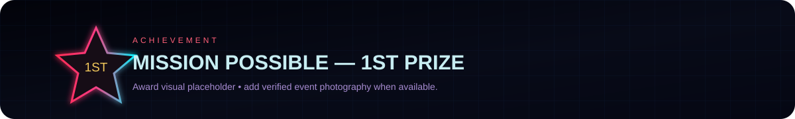

## GITHUB ACTIVITY

  
  

## CONNECT

  <a href="https://github.com/imranabdul-cmd">GitHub</a> &nbsp;•&nbsp;
  <a href="https://www.linkedin.com/in/imran-aupe">LinkedIn</a> &nbsp;•&nbsp;
  <a href="https://imran-aupe.vercel.app/">Portfolio</a> &nbsp;•&nbsp;
  <a href="mailto:imran.abdul.official@gmail.com">Email</a>

