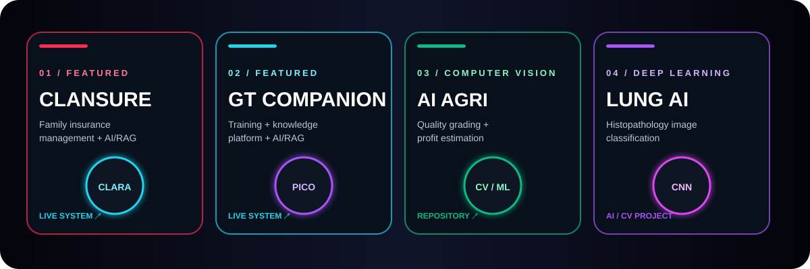

<!--
  IMRAN A — PROFILE README
  Designed from scratch as a cinematic AI/software engineering portfolio.
-->

  
  
  
  

## ✦ ABOUT ME

<table>
<tr>
<td width="58%" valign="top">

### Imran A

**Software Engineer · AI Engineer**  
**OwlSure — a business unit of ValueMomentum**  
**Chennai, Tamil Nadu, India**

I build software where **engineering, artificial intelligence, generative AI and product thinking** meet.

My direction moved from academic AI and computer vision into complete product systems — APIs, data, RAG pipelines, user experiences, deployment and the engineering practices that make them usable.

~~~yaml
identity:
  name: "Imran A"
  role: "Software Engineer | AI Engineer"
  focus:
    - Artificial Intelligence
    - Generative AI
    - RAG / LLM applications
    - Product Engineering
    - Modern Full-Stack Development

education:
  masters: "MCA — Generative AI"
  university: "SRM University, Chennai"
  bachelors: "B.Sc Computer Science"
  college: "PSG College of Arts & Science"
  percentage: "74.77%"
~~~

</td>

<td width="42%" valign="top" align="center">

  

</td>
</tr>
</table>

---

## ◈ WHAT I BUILD

<table>
<tr>
<td width="33%" align="center">
<h3>Intelligence</h3>
Artificial Intelligence 
Generative AI 
LLMs 
RAG 
Computer Vision
</td>
<td width="33%" align="center">
<h3>Engineering</h3>
Python · C# 
ASP.NET Core 
React · TypeScript 
FastAPI · REST APIs
</td>
<td width="33%" align="center">
<h3>Data & Cloud</h3>
PostgreSQL · Redis 
pgvector 
Databricks · Fabric 
Azure · Railway · CI/CD
</td>
</tr>
</table>

---

## ⚡ FEATURED SYSTEMS

### ClanSure

**Family Insurance Management Platform**

Centralized family insurance information with policies, documents, claims, renewals, family relationships, marketplace flows and an AI assistant.

**AI:** Clara · RAG · Gemini · pgvector  
**Stack:** React · TypeScript · ASP.NET Core · PostgreSQL · FastAPI · LangChain · Redis

<a href="https://family-portal.up.railway.app/">Live system ↗</a>

### GT Companion

**Training & Knowledge Platform**

A structured training and knowledge system that brings learning resources, roadmaps, videos, quizzes and mentor content into one place.

**AI:** Pico · RAG · Gemini  
**Stack:** React · TypeScript · ASP.NET Core · PostgreSQL · FastAPI · LangChain

<a href="https://gt-companion.up.railway.app/#landing">Live system ↗</a>

### AI Agri Quality Inspection

Computer-vision driven fruit quality inspection, grading, defect analysis and profit estimation.

**Stack:** Python · Flask · TensorFlow · Keras · OpenCV · SQLite

<a href="https://github.com/imranabdul-cmd/AGRI-GRADE-AUTOMATED-QUALITY-GRADING-AND-PROFIT-ESTIMATION-SYSTEM-">Repository ↗</a>

### Lung Cancer Detection

Histopathology image classification using deep learning and image preprocessing across benign tissue, adenocarcinoma and squamous cell carcinoma classes.

**Stack:** Python · TensorFlow · Keras · OpenCV

---

## 🧠 AI SYSTEM DESIGN

My preferred mental model:

**problem → product → intelligence → data → delivery**

That means the model is only one part of the system. The useful outcome depends on retrieval quality, service boundaries, data design, observability, deployment and the product experience around it.

---

## 🎬 BUILD SIGNAL

<table>
<tr>
<td width="62%" valign="top">

### A small look at the engineering mindset

</td>
<td width="38%" valign="top">

### Current focus

- Generative AI
- RAG systems
- LLM applications
- AI product development
- Databricks
- Microsoft Fabric
- Data engineering
- Cloud & deployment
- Modern full-stack engineering

 

### Principles

**Build for the user.**  
**Ground the model.**  
**Keep systems observable.**  
**Ship the smallest useful version.**  
**Keep learning after deployment.**

</td>
</tr>
</table>

---

## 🧩 TECH STACK

  

---

## 🏆 MISSION POSSIBLE

  

A practical project-building challenge focused on solving real-world problems through software.

Our team built **ClanSure** and **GT Companion** and secured **1st Prize**.

---

## 🎓 EDUCATION

<table>
<tr>
<td width="52%">

### MCA — Generative AI

**SRM University, Chennai**  
Currently pursuing

</td>
<td width="48%">

### B.Sc Computer Science

**PSG College of Arts & Science**  
**74.77%**

</td>
</tr>
</table>

---

## 📊 GITHUB ACTIVITY

  

  

---

## 🌐 CONNECT

 

  

Built with curiosity, product thinking and a bias toward shipping.

