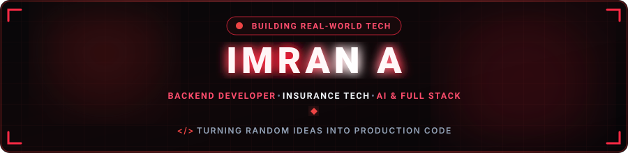
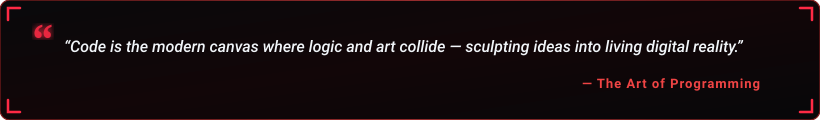

<p align="center">
  
</p>

<p align="center">
  <a href="https://github.com/imranabdul-cmd"></a>
  <a href="https://www.linkedin.com/in/imran-aupe"></a>
  <a href="https://imran-aupe.vercel.app/"></a>
  <a href="mailto:imran.abdul.official@gmail.com"></a>
</p>

<p align="center"><code>SOFTWARE ENGINEER</code> &nbsp; <code>AI ENGINEER</code> &nbsp; <code>CHENNAI, INDIA</code></p>

---

## 01 // IDENTITY

```text
┌──────────────────────────────────────────────────────────────────────┐
│  IMRAN A                                                            │
│  Software Engineer | AI Engineer                                    │
│  OwlSure — a business unit of ValueMomentum                         │
│  Chennai, Tamil Nadu, India                                         │
└──────────────────────────────────────────────────────────────────────┘
```

I build at the intersection of **software engineering, artificial intelligence, generative AI, and product development**—turning practical problems into useful systems.

## 02 // JOURNEY

```text
Computer Science
      │
      ├── Practical problem solving
      ├── AI + computer vision projects during college
      └── Software Engineering + AI + Generative AI + Product Development
```

My path began with Computer Science and hands-on problem solving. It evolved through AI and computer-vision work into a focused direction: designing and building modern software products augmented by intelligent systems.

## 03 // EDUCATION

| Program | Institution | Status / Result |
| --- | --- | --- |
| **MCA — Generative AI** | SRM University, Chennai | Currently pursuing |
| **B.Sc Computer Science** | PSG College of Arts & Science | 74.77% |

## 04 // PROFESSIONAL EXPERIENCE

### OwlSure — a business unit of [ValueMomentum](https://www.owlsure.com/home-global/?geo=global&geosub=in)

**Software Engineer — AI Engineer role**

Building toward practical, product-minded engineering across software and AI.

## 05 // MISSION POSSIBLE — 1ST PRIZE

```text
MISSION POSSIBLE / OFFICE EVENT
━━━━━━━━━━━━━━━━━━━━━━━━━━━━━━
06 teams  ×  09 members  =  54 participants

RESULT  →  1ST PRIZE
```

## 06 // CLANSURE

### Family Insurance Management Platform

**AI assistant:** Clara<br>
**System status:** [Open live system ↗](https://family-portal.up.railway.app/)

```text
Family insurance management
            │
            └── Clara / AI assistant
```

## 07 // GT COMPANION

### Training & Knowledge Platform

**AI assistant:** Pico<br>
**System status:** [Open live system ↗](https://gt-companion.up.railway.app/#landing)

```text
Training + knowledge
         │
         └── Pico / AI assistant
```

## 08 // COMMON ENGINEERING STACK

```text
┌──────────────── Product & interface ────────────────┐
│  React · TypeScript · HTML · CSS · JavaScript        │
└──────────────────────────┬──────────────────────────┘
                           │
┌──────────────── Application & intelligence ─────────┐
│  Python · C# · ASP.NET Core · FastAPI · REST APIs    │
│  LangChain · Gemini API · LLMs · RAG                 │
└──────────────────────────┬──────────────────────────┘
                           │
┌──────────────── Data & delivery ────────────────────┐
│  PostgreSQL · Redis · pgvector · GitHub · CI/CD      │
│  Railway                                             │
└─────────────────────────────────────────────────────┘
```

## 09 // LUNG CANCER DETECTION

### Lung Cancer Detection Using Histopathology Images

A computer-vision project using **TensorFlow, Keras, OpenCV, and Python**.

```text
Histopathology images → Computer vision workflow → Detection output
```

## 10 // AI AGRI QUALITY INSPECTION

### AI Agri Quality Inspection System

Automated quality grading and profit estimation system built with **Python, Flask, TensorFlow, Keras, OpenCV, HTML, CSS, JavaScript, and SQLite**.

[Explore the repository ↗](https://github.com/imranabdul-cmd/AGRI-GRADE-AUTOMATED-QUALITY-GRADING-AND-PROFIT-ESTIMATION-SYSTEM-)

```text
Agricultural input → AI quality inspection → Grading + profit estimation
```

## 11 // TECHNICAL INTERESTS

<p align="center">
  
</p>

| Intelligence | Engineering | Data, Cloud & Delivery |
| --- | --- | --- |
| Artificial Intelligence · Generative AI · Machine Learning · Deep Learning · Computer Vision · LLMs · RAG | Python · C# · ASP.NET Core · REST APIs · React · TypeScript · FastAPI · LangChain · Gemini API | PostgreSQL · Redis · pgvector · GitHub · CI/CD · Railway · Databricks · Microsoft Fabric · Azure Data Factory · ADLS Gen2 |

## 12 // CURRENT LEARNING

```text
[ ACTIVE LEARNING QUEUE ]
01  Generative AI                 05  Databricks
02  RAG Systems                   06  Microsoft Fabric
03  Large Language Models         07  Data Engineering
04  AI Product Development        08  Cloud, deployment & modern full-stack development
```

## 13 // CERTIFICATION VAULT

```text
STATUS: No certifications listed in this profile.
```

A deliberately reserved space for verified credentials as they are earned.

## 14 // ENGINEERING PRINCIPLES

- **Start with the real problem.** Build for practical use, not novelty alone.
- **Join intelligence with engineering.** AI is most valuable when it strengthens a complete product.
- **Keep learning in public through work.** Every project is an opportunity to sharpen systems thinking.

## 15 // GITHUB ANALYTICS

<p align="center">
  
  
</p>

## 16 // CONTRIBUTION MATRIX

<p align="center">
  
</p>

## 17 // LIVE SYSTEMS

| System | Purpose | Access |
| --- | --- | --- |
| **ClanSure** | Family Insurance Management Platform · Clara AI assistant | [Launch ↗](https://family-portal.up.railway.app/) |
| **GT Companion** | Training & Knowledge Platform · Pico AI assistant | [Launch ↗](https://gt-companion.up.railway.app/#landing) |
| **Portfolio** | Personal portfolio | [Open ↗](https://imran-aupe.vercel.app/) |

## 18 // CONNECT

<p align="center">
  <a href="https://github.com/imranabdul-cmd">GitHub</a>
  &nbsp;•&nbsp;
  <a href="https://www.linkedin.com/in/imran-aupe">LinkedIn</a>
  &nbsp;•&nbsp;
  <a href="https://imran-aupe.vercel.app/">Portfolio</a>
  &nbsp;•&nbsp;
  <a href="mailto:imran.abdul.official@gmail.com">imran.abdul.official@gmail.com</a>
</p>

<p align="center">
  
</p>

<p align="center">
  
</p>
