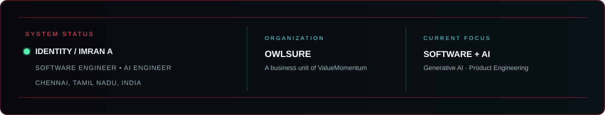
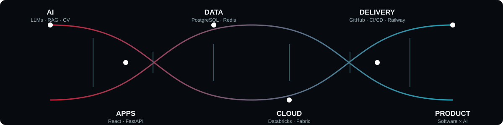
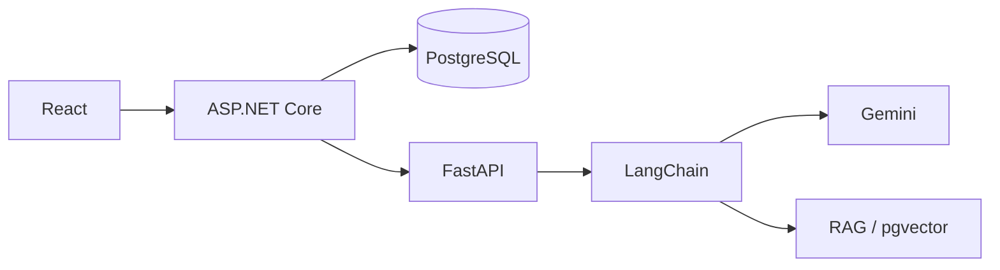

  

  <a href="https://github.com/imranabdul-cmd">GitHub</a>&nbsp;&nbsp;•&nbsp;&nbsp;
  <a href="https://www.linkedin.com/in/imran-aupe">LinkedIn</a>&nbsp;&nbsp;•&nbsp;&nbsp;
  <a href="https://imran-aupe.vercel.app/">Portfolio</a>&nbsp;&nbsp;•&nbsp;&nbsp;
  <a href="mailto:imran.abdul.official@gmail.com">Email</a>

  

## // SIGNAL

Started in Computer Science with a practical problem-solving mindset. Built AI and computer-vision projects during college; now focused on **software engineering + artificial intelligence + generative AI + product development**.

## // TECH DNA

  

<b>Engineering toolkit</b>

 

**AI & intelligence** — Artificial Intelligence · Generative AI · Machine Learning · Deep Learning · Computer Vision · LLMs · RAG · LangChain · Gemini API 
**Software & product** — Python · C# · ASP.NET Core · REST APIs · React · TypeScript · FastAPI 
**Data & delivery** — PostgreSQL · Redis · pgvector · GitHub · CI/CD · Railway · Databricks · Microsoft Fabric · Azure Data Factory · ADLS Gen2

## // FEATURED SYSTEMS

<table>
<tr>
<td width="50%" valign="top">

### 01 — CLANSURE
**Family Insurance Management Platform**

| | |
| --- | --- |
| **Problem** | Family insurance management |
| **System** | Product platform with **Clara** AI assistant |
| **Tech** | React · ASP.NET Core · PostgreSQL · FastAPI |
| **AI** | LangChain · Gemini · RAG / pgvector |
| **Live** | [Launch ClanSure ↗](https://family-portal.up.railway.app/) |

</td>
<td width="50%" valign="top">

### 02 — GT COMPANION
**Training & Knowledge Platform**

| | |
| --- | --- |
| **Problem** | Training and knowledge access |
| **System** | Product platform with **Pico** AI assistant |
| **Tech** | React · ASP.NET Core · PostgreSQL · FastAPI |
| **AI** | LangChain · Gemini · RAG / pgvector |
| **Live** | [Launch GT Companion ↗](https://gt-companion.up.railway.app/#landing) |

</td>
</tr>
</table>

```mermaid
flowchart LR
  UI[React] --> API[ASP.NET Core]
  API --> DB[(PostgreSQL)]
  API --> AI[FastAPI]
  AI --> LC[LangChain] --> GM[Gemini]
  LC --> RAG[RAG / pgvector]
```

Conceptual product + AI architecture for the featured platforms.

<table>
<tr>
<td width="50%" valign="top">

### 03 — AI AGRI QUALITY INSPECTION
**Computer Vision / ML**

| | |
| --- | --- |
| **Problem** | Quality grading and profit estimation |
| **System** | AI Agri Quality Inspection System |
| **Tech** | Python · Flask · TensorFlow · Keras · OpenCV · SQLite |
| **AI** | Computer vision and machine learning |
| **Repository** | [Explore source ↗](https://github.com/imranabdul-cmd/AGRI-GRADE-AUTOMATED-QUALITY-GRADING-AND-PROFIT-ESTIMATION-SYSTEM-) |

</td>
<td width="50%" valign="top">

### 04 — LUNG CANCER DETECTION
**Deep Learning / Computer Vision**

| | |
| --- | --- |
| **Problem** | Histopathology image analysis |
| **System** | Lung Cancer Detection Using Histopathology Images |
| **Tech** | TensorFlow · Keras · OpenCV · Python |
| **AI** | Deep learning and computer vision |
| **Access** | Project profile entry |

</td>
</tr>
</table>

## // EXPERIENCE

<table>
<tr><td width="16%" align="center"><b>2026 → Present</b></td><td>

### [OWLSURE](https://www.owlsure.com/home-global/?geo=global&geosub=in)
*A business unit of ValueMomentum*

**Software Engineer** &nbsp; / &nbsp; **AI Engineer role**

</td></tr>
</table>

## // MISSION POSSIBLE

<table><tr><td align="center" width="28%"><h1>🏆</h1>PHOTO SLOT Real trophy photo can be added here.</td><td>

### Mission Possible — 1st Prize

</td></tr></table>

## // EDUCATION

| Status | Program | Institution |
| --- | --- | --- |
| **Now** | **MCA — Generative AI** | SRM University, Chennai · Currently pursuing |
| **Foundation** | **B.Sc Computer Science** | PSG College of Arts & Science · 74.77% |

## // CURRENT FOCUS

  <code>GENERATIVE AI</code> &nbsp; <code>RAG</code> &nbsp; <code>LLMs</code> &nbsp; <code>AI PRODUCT DEVELOPMENT</code>  
  <code>DATABRICKS</code> &nbsp; <code>MICROSOFT FABRIC</code> &nbsp; <code>DATA ENGINEERING</code>

## // CERTIFICATION VAULT

> **Vault status:** no verified certificate assets are currently included in this repository.

## // GITHUB TELEMETRY

  
  

  

  

  

  

