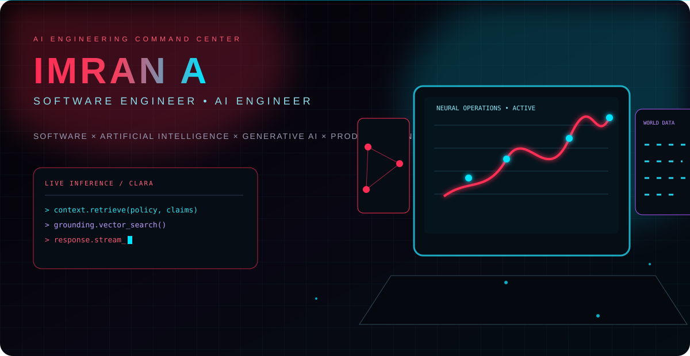
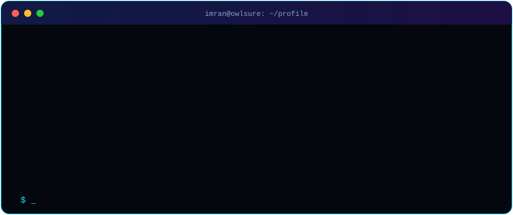
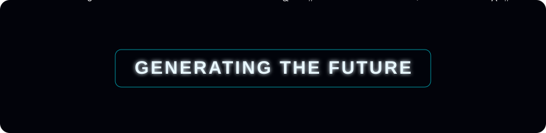
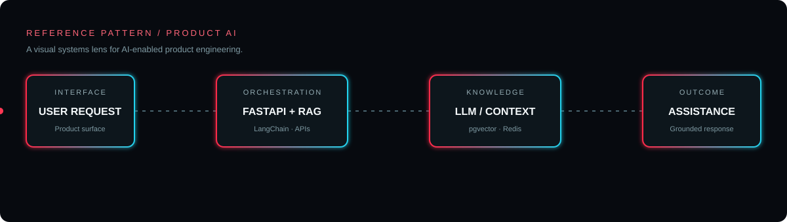
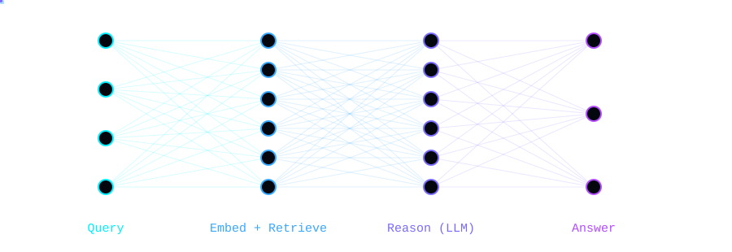
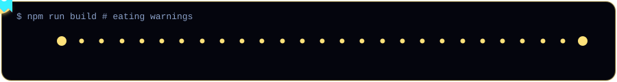
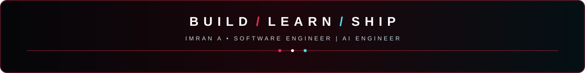

<table>
<tr>
<td width="38%" align="center" valign="middle">

</td>
<td width="62%" valign="middle">



</td>
</tr>
</table>



<a href="https://family-portal.up.railway.app/"></a>
<a href="https://gt-companion.up.railway.app/#landing"></a>
<a href="https://github.com/imranabdul-cmd/AGRI-GRADE-AUTOMATED-QUALITY-GRADING-AND-PROFIT-ESTIMATION-SYSTEM-"></a>







<table>
<tr>
<td width="55%"></td>
<td width="45%"></td>
</tr>
</table>

 

### ⚛️ Frontend

&nbsp;

&nbsp;

### ⚙️ Backend & AI

 

&nbsp;

&nbsp;

### 🗄️ Data, Cache & Vector Search

&nbsp;

### 🔧 Git, GitHub & Deployment

&nbsp;

<b>Full icon stack</b>




## 🔗 Featured Work

- [Personal Portfolio](https://imranabdul-cmd.github.io/portfolio/)
- [AI Agri Quality Inspection](https://github.com/imranabdul-cmd/AGRI-GRADE-AUTOMATED-QUALITY-GRADING-AND-PROFIT-ESTIMATION-SYSTEM-)
- [Lung Detector AI](https://github.com/imranabdul-cmd/lung-detector-ai)

> **Selected product work:** ClanSure and GT Companion are presented as live product/case-study experiences. Public source code is not included where company ownership or IP restrictions apply.

### 🌐 [Enter the Portfolio](https://imranabdul-cmd.github.io/portfolio/)



